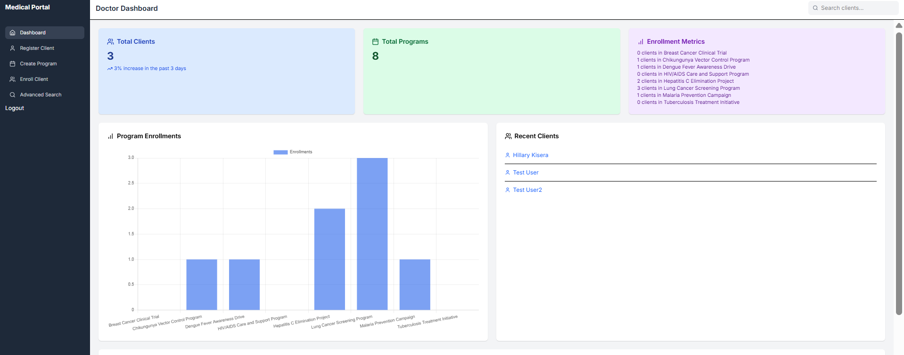

"# HealthReachCEMA_Backend"

Screen Shot

,

HealthReach CEMA - Health Information System
Overview
HealthReach CEMA is a health information system designed to manage clients and health programs/services, such as TB, Malaria, and HIV. The system allows doctors to create health programs, register clients, enroll clients in programs, search for clients, view client profiles, and expose client profiles via a REST API. The backend is built with Django and SQLite, while the frontend is developed using Next.js. The application is deployed with Render for the backend and Vercel for the frontend.

Features

Create Health Programs: Define and manage health programs (e.g., TB, Malaria, HIV).
Register Clients: Add new clients to the system with relevant details.
Enroll Clients in Programs: Assign clients to one or more health programs.
Search Clients: Search for clients from the list of registered clients.
View Client Profiles: Display client details, including enrolled programs.
API Integration: Expose client profiles via a REST API (documented with Swagger).
Data Security: Basic authentication and authorization implemented.(JWT)
Deployment: Backend deployed on Render, frontend on Vercel.

Tech Stack

Backend: Django, Django REST Framework, SQLite
Frontend: Next.js with Typescript, Tailwind CSS
API Documentation: Swagger (via drf-yasg)
Deployment:
Backend: Render
Frontend: Vercel

Version Control: Git (GitHub)

Setup Instructions
Prerequisites

Python 3.8+
Node.js 18+
Git

Backend Setup (Django)

Clone the repository:
Backend : git clone git@github.com:senseikh/HealthReachCEMA_Backend.git
Frontend : git clone git@github.com:senseikh/HealthReachCEMA_Frontend.git

On HealthReachBackend >

Create a virtual environment and activate it:python -m venv venv
source venv/bin/activate # On Windows: venv\Scripts\activate

Install dependencies:pip install -r requirements.txt

Apply migrations:python manage.py migrate

Create a superuser (admin):python manage.py createsuperuser

Use the following credentials for testing:
Email: Admin@gmail.com
Password: Admin@1234

Run the development server:python manage.py runserver

Frontend Setup (Next.js)

Navigate to the frontend directory:cd frontend

Install dependencies:npm install

Run the development server:npm run dev

Access the frontend at http://localhost:3000.

API Documentation
The API is documented using Swagger. Access the Swagger UI at:
swaggerhttps://healthreachcema-backend.onrender.com/swagger/

This provides detailed documentation for endpoints, including:

POST /api/clients/: Register a new client.
GET /api/clients/: Search/list clients.
GET /api/clients/{id}/: View client profile.
POST /api/programs/: Create a health program.
POST /api/enrollments/: Enroll a client in a program.

Deployment

Frontend: Deployed on Vercel at https://health-reach-cema-frontend.vercel.app/
Backend: Deployed on Render https://healthreachcema-backend.onrender.com.
Database: SQLite (used for simplicity in deployment).

Security Considerations

Authentication: Django's built-in authentication system with email-based login.
Authorization: Only authenticated users (doctors) can access client data.
API Security: Token-based authentication for API endpoints (optional, can be enabled).
Data Validation: Input validation on both frontend and backend to prevent invalid data.

Testing

Backend: Basic unit tests for models and API endpoints (HealthReahbackend/Programs/test.py).
Frontend: Limited tests using Jest (see frontend/tests/).
Run backend tests:python manage.py test

Run frontend tests:npm test

Innovations & Optimizations

API-First Approach: RESTful API designed for scalability and integration.
Responsive UI: Frontend built with Tailwind CSS for a clean, responsive design.
Search Optimization: Efficient client search using Django ORM filters.
Documentation: Swagger for API documentation, improving developer experience.

Repository

GitHub:
Commit history reflects clean, incremental changes with descriptive messages.

Presentation & Demonstration

PowerPoint: A presentation outlining the approach, design, and solution is available in the repository (docs/ProjectHealthReachPowerPoint.pptx).
Prototype Demo: A live demo is available at the deployed frontend URL. A video walkthrough is also included in the repository (docs/demo.mp4).

Future Improvements

Add advanced search filters (e.g., by program or status).
Implement pagination for large client lists.
Enhance security with JWT authentication for APIs.
Add more comprehensive unit and integration tests.

Contact
For any issues or inquiries, please contact:

Email: hillarykisera@gmail.com
GitHub Issues: Raise an issue in the repository.

Thank you for reviewing HealthReach CEMA project!
